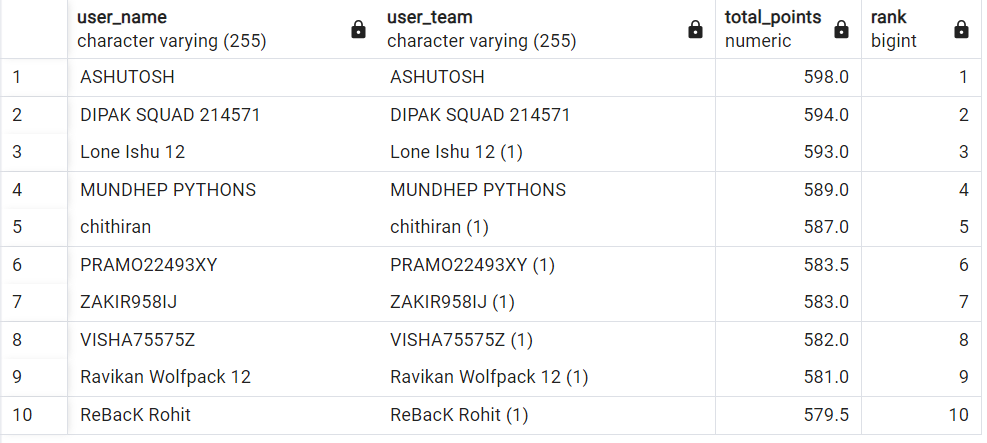
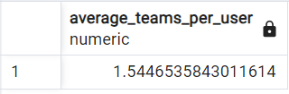
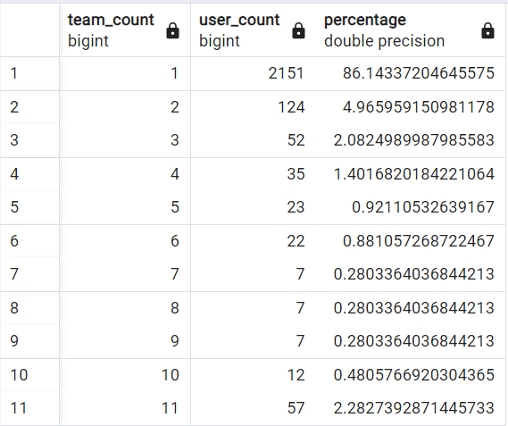
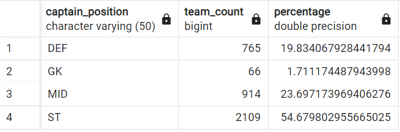
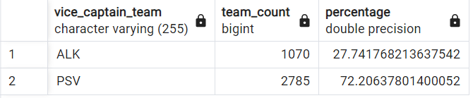

# BeatFantasy_DataAnalysis

## Instructions

### Prerequisites

- PostgreSQL installed on your machine.
- Clone this repository to your local machine.

### Step 1: Download the CSV Files

Download the CSV files from this repository:

- [user_teams.csv](https://github.com/anshbabbar15/BeatFantasy_DataAnalysis/blob/main/user_teams.csv)
- [players.csv](https://github.com/anshbabbar15/BeatFantasy_DataAnalysis/blob/main/players.csv)

### Step 2: Create Tables in PostgreSQL

1. Connect to your PostgreSQL database using your preferred method (e.g., `psql`, a database client like pgAdmin, etc.).
2. Create the `user_teams` and `player_points` tables using the following schema:

   ```sql
   CREATE TABLE user_teams (
       user_name VARCHAR(255),
       user_team VARCHAR(255),
       player1_captain VARCHAR(255),
       player2_vice_captain VARCHAR(255),
       player3 VARCHAR(255),
       player4 VARCHAR(255),
       player5 VARCHAR(255),
       player6 VARCHAR(255),
       player7 VARCHAR(255),
       player8 VARCHAR(255),
       player9 VARCHAR(255),
       player10 VARCHAR(255),
       player11 VARCHAR(255)
   );

   CREATE TABLE player_points (
       player_id SERIAL PRIMARY KEY,
       player_name VARCHAR(255),
       team_name VARCHAR(255),
       player_pos VARCHAR(50),
       player_points INTEGER,
       sel_percent DECIMAL(5, 2),
       c_percent DECIMAL(5, 2),
       vc_percent DECIMAL(5, 2)
   );
   ```

## Answers
What were the top 10 user teams in the match and what were their respective ranks?









